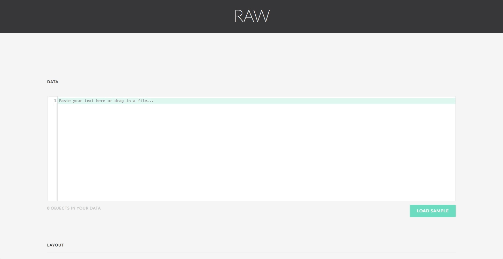

RAWGraphs was initially conceived as an internal tool to improve our process of visual bootstrapping. In order to speed up the process of visual exploration of different datasets, we needed a tool that would allow the creation of charts that were not easy to produce without coding skills. One of the main focus from the beginning was to design an easy to use interface on top of d3.js that would easily produce open semi-finished outputs to be refined with other vector graphics softwares. 

&nbsp;

For this reason, we didn’t want to include a lot of functionalities to transform and manage data (that were already included in tools such as Microsoft Excel, Open Refine or Google Spreadsheet) and to refine the visualizations (that were already included in tools such Adobe Illustrator). We wanted something essential that would streamline the process of importing and mapping data and exporting the semi-finished visualizations in vector format.

The very first version of the interface that you can see above and thas was never published represents this idea very well. The interface is divided in 3 parts (data, mapping and layout) each one dedicated to a well defined action. The main difference between this version and the following versions is that the text box where you import your data collapses to show only the headers of the columns.

Thanks to some workshops and activities that allowed us to observe other people using the tool, we started an interative design process that brought us to a newer version of RAWGraphs that is similar to the one online. The different phases are divided into steps so that the user can easily go back to the data and modify it. The process of mapping the data variables with the visual variables of the layout has been reconceived to facilitate the drag and drop interaction. 

This interface has been the foundation of the <a href="http://www.densitydesign.org/2013/10/raw-the-missing-link-between-spreadsheets-and-vector-graphics/" target="_blank" rel="noopener">first version we released in 2013</a>. From that moment on we worked on improving the UI elements and adding new charts as you can see from the old video tutorials below.

We believe that one of the reasons many people use RAWGraphs (more than 10.000 users monthly) is because of its easy to use interface and we will keep on working on its improvement.If you have suggestions or feedbacks that can help us in the design process feel free to <a href="https://github.com/densitydesign/raw/issues" target="_blank" rel="noopener">open new issues on our Github repository</a>.
