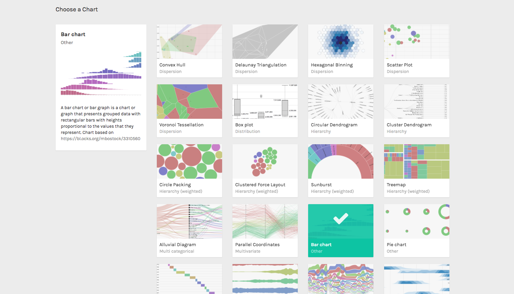

RAWGraphs is meant to quickly produce visualizations that are difficult to produce with other softwares. Bar chart are quite common in any visualization software: what we added is the ability to quickly create multiple bar charts sharing the same categories, and use colors to highlight part of them according to the data.

**GOAL OF THE TUTORIAL**: comparing the most used letters of the alphabet in three languages: english, italian and german and highlighting the top three most used letters with different colors.

### 01. Load your data

The first step is to load your data into RAWGraphs.

The data must contain at least two columns: one containing the name of the categories (in our case Letters), the second one containing their values (in our case Value). If you want to create multiple bar charts, a third column is required, containing the name of the group (Language). An additional optional column can be used to define each bar color (Rank).

Here you can see the dataset we are going to use:

You can also download it through the link on the left or select it directly in the app through the sample datasets. In few second you should see the green bar saying “78 records in your data have been successfully parsed!”

**Note**: The described dataset structure is often referred as ‘stacked’ or ‘narrow’. If you have data as wide/unstacked form, you can use the “stack/unstack” button.

### 02. Choose the bar chart layout

After pasting your data, scroll down and select the “bar chart” visual model.

### 03. Map your dimensions

The barchart layout has four visual variables:

<table>
<tbody>
<tr>
<td><b>VARIABLE</b></td>
<td><b>TYPE</b></td>
<td><b>REQUIRED?</b></td>
<td><b>MULTIPLE?</b></td>
<td><b>DESCRIPTION</b></td>
</tr>
<tr>
<td><b>X axis</b></td>
<td>string, numbers</td>
<td>&nbsp;[fa class=”fa-asterisk”]</td>
<td></td>
<td>For each unique value found in the column, a group (a new bar chart) is created.</td>
</tr>
<tr>
<td><b>Group</b></td>
<td>string, numbers</td>
<td></td>
<td></td>
<td>For each unique value found in the column, a bar is created.</td>
</tr>
<tr>
<td><b>Size</b></td>
<td>number</td>
<td></td>
<td></td>
<td>Accepts only columns containing numbers. The value will define the bar height.</td>
</tr>
<tr>
<td><b>Color</b></td>
<td>string, numbers</td>
<td></td>
<td></td>
<td>Can accept both number and strings. A color will be defined for each unique value found in the list.</td>
</tr>
</tbody>
</table>

It’s time to map your data and create the visualization. On the left you have the list of dimensions in your dataset, on the right the available visual variable of the bar chart layout.

Drag and drop the dimensions as following:

- Drag Letter into X Axis;
- Drag Frequency into Height;
- Drag Language into Groups;
- Drag Rank into Color.

In this way we created a bar for each letter (mapping it on the X Axis). We divided the visualization in three barcharts, one per language, mapping languages as Groups.  
We defined the height of the bars mapping the frequency of each letter. Finally, we generated one color for each unique value found in the Rank column.

### 04. Refine and export

To reach the final results we can customize the visualization with some parameters you can find next to the visualization.  
For the bar chart the options available are the following:

<table>
<tbody>
<tr>
<td>OPTION</td>
<td>DESCRIPTION</td>
</tr>
<tr>
<td>width</td>
<td>artboard width in pixels</td>
</tr>
<tr>
<td>height</td>
<td>artboard height in pixels</td>
</tr>
<tr>
<td>vertical padding</td>
<td>distance among bar charts, in pixel</td>
</tr>
<tr>
<td>horizontal padding</td>
<td>distance between bars, in percentage of the size of the bar (0 = 0%, 1 = 100%)</td>
</tr>
<tr>
<td>use same scale</td>
<td>If set, every barchart element will have the same scale</td>
</tr>
<tr>
<td>colour scale</td>
<td>list of uniques values in the dimension mapped as “color”. If set to ordinal, you can set a color for each value. If set to linear, the app will try to find the minimum and maximum value contained in the dimension, and then creating a gradient among those two values</td>
</tr>
</tbody>
</table>

For the final results we have set the options as following:

- Horizontal padding to 0.05
- Flag use the same scale
- Change the colors according to [this palette](http://www.colourlovers.com/palette/4053585/Iranian_horse). Copy and paste the hex codes as following: for “1”,  #DD5F12. For “2”, #E8A264. For “3”, “#FFE1AB”. For “others”, “#D3E1EE”. When you define a color using its <a href="https://en.wikipedia.org/wiki/Web_colors#Hex_triplet">hexadecimal code</a>, remember always to put the hash symbol # before the number

Here is the finished chart. You can export it in svg or png using the download function at the bottom of the page.

