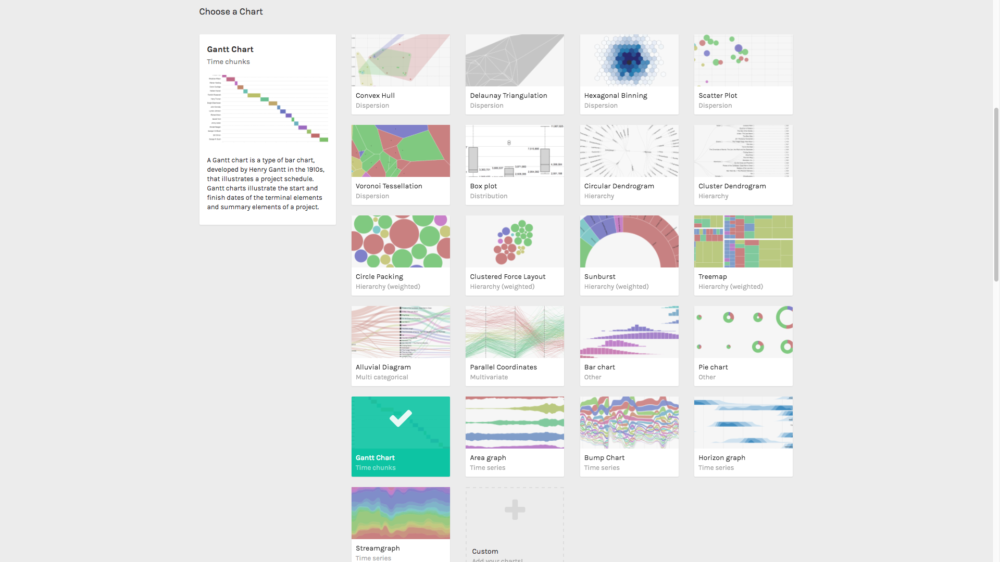
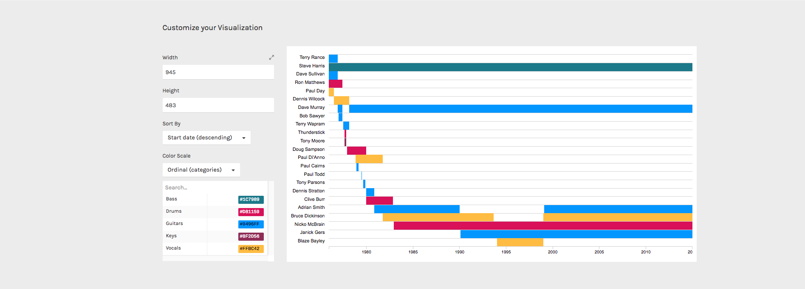

Gantt charts are horizontal bar charts defining time spans. They are useful when you want to show events in time defined by a starting and an ending date.

**GOAL OF THE TUTORIAL:** Create a visualization of Iron Maiden lineup, identifying the different roles of the band members.

### 01. Load your data

The first step is to copy and paste your data into RAWGraphs.

The data must contain at least three columns: one containing the start date (in our case, Begin) one containing the ending date (in our case End) and a column identifying how to group multiple time span (in our case, Name). An additional column can be used to define each bar color (in our case, Role). Here you can see the dataset we’re going to use.

Dates must be formatted in a specific way if you want to use them in RAWGraphs: <a href="https://github.com/densitydesign/raw/wiki/Date-formats">check here the accepted formats</a>.

Here you can see the dataset we are going to use:

<iframe src="https://docs.google.com/spreadsheets/d/1xaupcv1d8IIcndeFJL_781zSa_LvCeEJNKUpw3g7x8I/pubhtml?widget=true&amp;headers=false" width="100%" height="300"></iframe>

You can also download it through the link on the left or select it directly in the app through the sample datasets. In few second you should see the green bar saying “26 records in your data have been successfully parsed!”

### 02. Choose the Gantt chart layout

After pasting your data, scroll down and select the “Gantt chart” visual model.

### 03. Map your dimensions

The Gantt chart layout has four visual variables.

|            |                 |                          |          |                                                                                                                                    |
| ---------- | --------------- | ------------------------ | -------- | ---------------------------------------------------------------------------------------------------------------------------------- |
| VARIABLE   | TYPE            | REQUIRED                 | MULTIPLE | DESCRIPTION                                                                                                                        |
| Group      | String, numbers | [fa class=”fa-asterisk”] |          | For each unique value found in the column, a group (an horizontal series of bars) is created.                                      |
| Start date | Dates, numbers  | [fa class=”fa-asterisk”] |          | Starting point of the bar. RAWGraphs requires dates in [a specific format](https://github.com/densitydesign/raw/wiki/Date-formats) |
| End date   | Dates, numbers  | [fa class=”fa-asterisk”] |          | Ending point of the bar. RAWGraphs requires dates in [a specific format](https://github.com/densitydesign/raw/wiki/Date-formats).  |
| Color      | String, numbers |                          |          | Can accept both number and strings. A color will be defined for each unique value found in the list.                               |

It’s time to map your data and create the visualization. On the left you have the list of dimensions in your dataset, on the right the available visual variable of the bar chart layout. 

Drag and drop the dimensions as following:

<li style="font-weight: 400;">
  Drag Name into Group;
</li>
<li style="font-weight: 400;">
  Drag Begin int Start Date;
</li>
<li style="font-weight: 400;">
  Drag End into End Date;
</li>
<li style="font-weight: 400;">
  Drag Role into Color.
</li>

In this way we created a group of bars for each band member (mapping Name on the Group dimension). For every active period of the member we draw a rectangle with the values dragged in the Start Date and End Date. Finally, we generated one Color for each unique value found in the Role column.

### 04. Refine and export

To reach the final results we can customize the visualization with some parameters you can find next to the visualization. 

For the Gantt chart the options available are the following:

<table>
<tbody>
<tr>
<td>OPTION</td>
<td>DESCRIPTION</td>
</tr>
<tr>
<td><strong>Width</strong></td>
<td>Artboard width in pixels</td>
</tr>
<tr>
<td><strong>Height</strong></td>
<td>Artboard height in pixels</td>
</tr>
<tr>
<td><strong>Sort by</strong></td>
<td>Order of the bars series. Could be alphabetical or by date (both ascending and descending).</td>
</tr>
<tr>
<td><strong>Color scale</strong></td>
<td>If set to ordinal, you can set a color for each value; it lists all the unique values in the dimension mapped as “color”. If set to linear, the app will try to find the minimum and maximum value contained in the dimension, and then it creates&nbsp;a gradient among those two values</td>
</tr>
</tbody>
</table>

For the final results we have set the options as following:

- Width to 945 px
- Height to 483 px
- Sort by &#8220;Start date (descending)&#8221;
- Change the colors according to this palette:
- Bass to #1C7989
- Drums to #D81159
- Guitar to #0496FF
- Keys to #8F2D56
- Vocals to #FFBC42

Here is the finished chart. You can export it in SVG or PNG using the download function at the bottom of the page.

