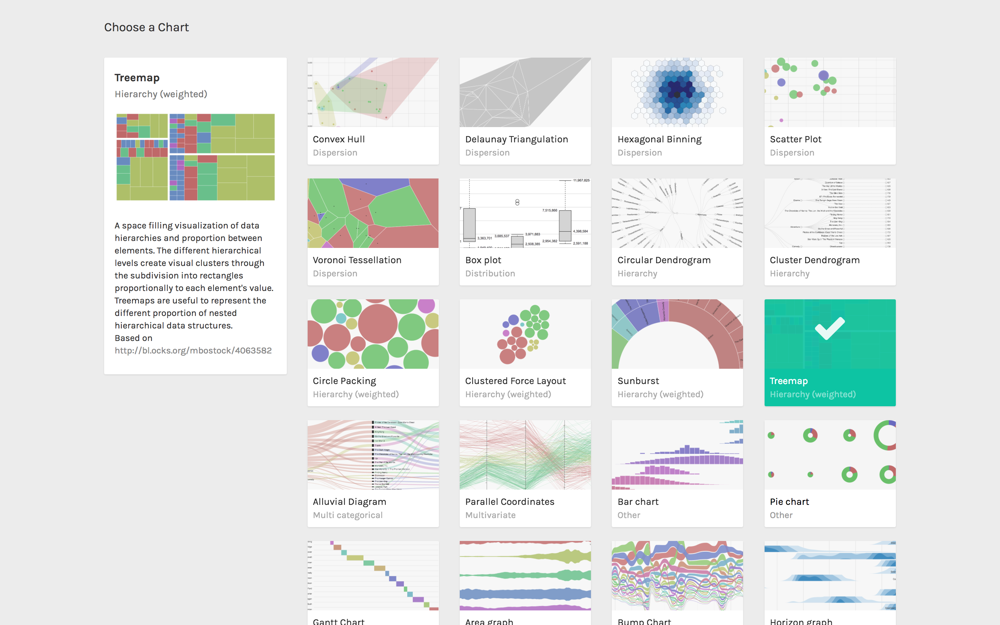
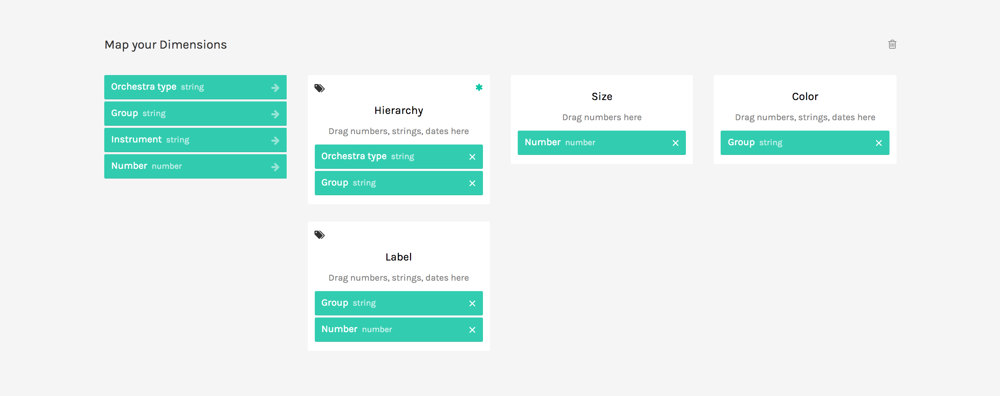

Treemap are useful to see the weight of categories belonging to a hierarchical structure. In this example, we will create such structure dividing the instruments by orchestra type, then type, and then single instrument.

**GOAL OF THE TUTORIAL**: Show the size of four different orchestras and their composition.

### 01. Load your data

The first step is to copy and paste your data into RAWGraphs.  
For this example we will use a dataset containing the instruments composing four different kind of orchestra. The data must contain one or more columns containing categories (in our case, Orchestra type and Group). Optionally you can add a column containing a number for the groups size (in our case, Number).

You can copy and paste the data from the table below:

<iframe src="https://docs.google.com/spreadsheets/d/1g3mYU-0ada18HjCtlm_t6il_VPo-rTvnsVZV4w-Q6P8/pubhtml?widget=true&amp;headers=false" width="100%" height="300"></iframe>

Otherwise, you can load the data from using the “Try our samples” button then choosing “Orchestras &#8211; Hierarchies (weighted)”.  
In few second you should see the green bar saying “101 records in your data have been successfully parsed!”

**Note:** The described dataset structure is often referred as ‘unstacked’ or ‘wide’. If you have data as narrow/stacked form, you can use the “stack/unstack” button: see the <a style="background-color: #ffffff;" href="https://rawgraphs.io/learning/stack-your-unstacked-data-meet-the-unpivoter">tutorial</a> here.

### 02. Choose the layout

After pasting your data, scroll down and select the “treemap” visual model.

### 03. Map your dimensions

The treemap layout has four visual variables:

<table>
<tbody>
<tr>
<td><strong>VARIABLE</strong></td>
<td><strong>TYPE</strong></td>
<td><strong>REQUIRED?</strong></td>
<td><strong>MULTIPLE?</strong></td>
<td><strong>DESCRIPTION</strong></td>
</tr>
<tr>
<td><strong>Hierarchy</strong></td>
<td>String, numbers, dates</td>
<td>[fa class=”fa-asterisk”]</td>
<td>[fa class=”fa-asterisk”]</td>
<td>For each dimension dragged here, a level in the hierarchy is created. The order of dimensions influences the hierarchy.</td>
</tr>
<tr>
<td><strong>Size</strong></td>
<td>Number</td>
<td></td>
<td></td>
<td>Size of the area for each date in the dataset. If not provided, size will be proportional to the count of rows.</td>
</tr>
<tr>
<td><strong>Color</strong></td>
<td>String, numbers, dates</td>
<td></td>
<td></td>
<td>For each unique value found in the dimension, a color is created.</td>
</tr>
<tr>
<td><strong>Label</strong></td>
<td>String, numbers, dates</td>
<td></td>
<td>[fa class=”fa-asterisk”]</td>
<td>Values will be used as labels. If more than one dimension are dragged, the label will contains the values separated by comma.</td>
</tr>
</tbody>
</table>

It’s time to map your data and create the visualization. On the left you have the list of dimensions in your dataset, on the right the available visual variable of the treemap chart layout. 

Drag and drop the dimensions as following:

- Orchestra type and Group as Hierarchy;
- Number as Size;
- Group as Color;
- Group and Number as Label.

In this way we created a hierarchical structure: first, dividing by Orchestra type, and then dividing each orchestra by instruments Group. For each group, we used the Number value as size. Finally, we created a label for each rectangle using the Group name and the Number.

### 04. Refine and export

To reach the final results we can customize the visualization with some parameters you can find next to the visualization. For the treemap the options available are the following:

<table>
<tbody>
<tr>
<td><strong>OPTION</strong></td>
<td><strong>DESCRIPTION</strong></td>
</tr>
<tr>
<td><strong>Width</strong></td>
<td>artboard width in pixels</td>
</tr>
<tr>
<td><strong>Height</strong></td>
<td>artboard height in pixels</td>
</tr>
<tr>
<td><strong>Padding</strong></td>
<td>Vertical distance among groups, in pixel</td>
</tr>
<tr>
<td><strong>Colour scale</strong></td>
<td>list of uniques values in the dimension mapped as “color”. If set to ordinal, you can set a color for each value. If set to linear, the app will try to find the minimum and maximum value contained in the dimension, and then creating a gradient among those two values.</td>
</tr>
</tbody>
</table>

For the final results we have set the options as following:

- Width to 940 pixels;
- Height to 483 pixels;
- Padding to 5 pixel;
- Set colors as following: Brass to #e8858f, Keyboards to #b185ba, Percussion to #9ecce0, Strings to #f7e372, Woodwinds to #81c7b6.

Here is the finished chart. You can export it in svg or png using the download function at the bottom of the page.

