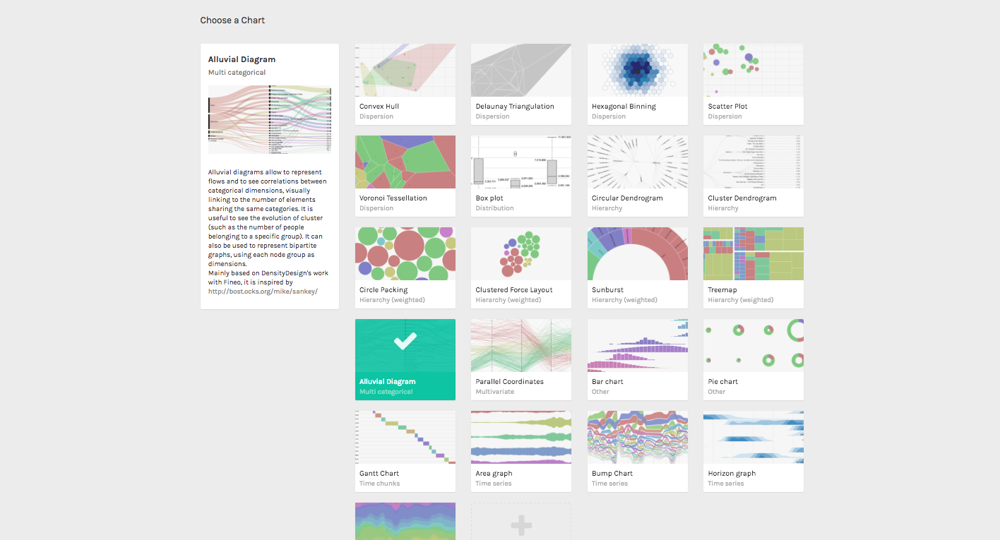
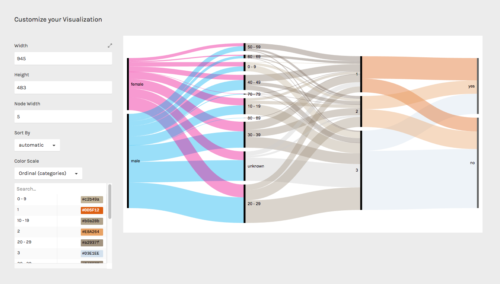

Alluvial diagrams are in many ways similar to sankey diagrams: they represents weighted flows among nodes. Alluvial diagrams are a specific kind of Sankey diagrams: they use the same logic to show how the same set of items regroups according to different dimensions.

Before starting we can define a small vocabulary, to avoid misinterpretations. We will call ‘nodes’ the black rectangles. We will call ‘flows’ the colored areas linking nodes. We will call ‘steps’ the vertical groups of nodes.

In RAWGraphs, you don’t define directly the size of edges among nodes. In our application each line of the dataset become a series of flows, each columns defines a step. The size of edges and of flows is therefore linked to the number of lines in the dataset containing the same couple of nodes. Flows coming from and going to the same couple of nodes are grouped.

**GOAL OF THE TUTORIAL:** Compare socio-demographic information about the passengers of the Titanic, trying to identify patterns among genre, age, fare class and chance to survive to the accident.

### **01. Paste your data**

The first step is to copy and paste your data into RAWGraphs.

The data must be structured in this way: each line of the dataset is an item, and each column is a property of such item.

To make an example:

<table>
  <tr>
    <td>
      Name
    </td>

    <td>
      Age
    </td>

    <td>
      City
    </td>

  </tr>

  <tr>
    <td>
      John
    </td>

    <td>
      30
    </td>

    <td>
      London
    </td>

  </tr>

  <tr>
    <td>
      Richard
    </td>

    <td>
      20
    </td>

    <td>
      Berlin
    </td>

  </tr>

  <tr>
    <td>
      Frank
    </td>

    <td>
      20
    </td>

    <td>
      Berlin
    </td>

  </tr>

  <tr>
    <td>
      Gabriele
    </td>

    <td>
      30
    </td>

    <td>
      Milan
    </td>

  </tr>
</table>

The data must contain at least two columns defining properties. Each additional column will define a new step in the alluvial diagram. An additional optional column can be used to define the line weight.

Here you can see the dataset we are going to use:

You can also select it directly in the app through clicking on ‘Try our samples’ > ‘Titanic’s Passengers’. In few second you should see the green bar saying “1309 records in your data have been successfully parsed!”.

### **02. Choose the layout**

After pasting your data, scroll down and select the “Alluvial Diagram” chart layout.

### **03. Map your dimensions**

The alluvial diagram has two visual variables.

<table>
  <tr>
    <td>
      VARIABLE
    </td>

    <td>
      TYPE
    </td>

    <td>
      REQUIRED
    </td>

    <td>
      MULTIPLE
    </td>

    <td>
      DESCRIPTION
    </td>

  </tr>

  <tr>
    <td>
      Steps
    </td>

    <td>
      String, numbers
    </td>

    <td>
      [fa class=&#8221;fa-asterisk&#8221;]
    </td>

    <td>
      [fa class=&#8221;fa-tags&#8221;]
    </td>

    <td>
      It accept multiple values, at least two column must be selected. Each dragged column will define a step (a vertical group of nodes). The dragging order is also the visualization order. For each unique value found in each column a node will be created.
    </td>

  </tr>

  <tr>
    <td>
      Size
    </td>

    <td>
      Numbers
    </td>

    <td>
    </td>

    <td>
    </td>

    <td>
      Defines the weight of each line of the dataset. If not defined, all the lines will have the same weight.
    </td>

  </tr>
</table>

&nbsp;

It’s time to map your data and create the visualization. On the left you have the list of dimensions in your dataset, on the right the available visual variable of the bar chart layout. 

Drag and drop the dimensions as following:

In this way we will create four different Steps. The first is Gender, with two nodes, male and female. The size of the two nodes is proportional to the number of nodes containing that value.

The second step is Age group, and it’s composed by 9 nodes: the first 8 for each decade, and a last one for all the people with unknown age. Also in this case the size of each node is proportional to the number of rows containing that specific value. The flows among nodes in the two steps represent the number of lines in the dataset sharing the same couple of values: for example the largest flow is from the node ‘male’ in the Gender step and the ‘20-29’ node in the Age groups step.

The same logic rules the following steps. The third one is Class and contains three nodes (first, second, third), the last step is Survival, containing two nodes (yes for survived, no for not survived).

We won’t use the size dimension in this tutorial.

### **04. Options**

To reach the final results we can customize the visualization with some parameters you can find next to the visualization. 

For the alluvial diagram the options available are the following:

<table>
  <tr>
    <td>
      OPTION
    </td>

    <td>
      DESCRIPTION
    </td>

  </tr>

  <tr>
    <td>
      width
    </td>

    <td>
      artboard width in pixels
    </td>

  </tr>

  <tr>
    <td>
      height
    </td>

    <td>
      artboard height in pixels
    </td>

  </tr>

  <tr>
    <td>
      Nodes width
    </td>

    <td>
      Width of black bars representing nodes, in pixels.
    </td>

  </tr>

  <tr>
    <td>
      Sort by
    </td>

    <td>
      Sorting of nodes inside each step. It can be ‘automatic’ (trying to reduce the number of overlappings among flows), ‘size’ (nodes ordered from the biggest to the smallest), and ‘alphabetical’.
    </td>

  </tr>

  <tr>
    <td>
      Color scale
    </td>

    <td>
      The color of flows. The color is defined by the source node. For each unique value found in the dimension dragged as ‘steps’ a color is defined.
    </td>

  </tr>
</table>

For the final results we have set the options as following:

<li style="font-weight: 400;">
  Width to 945
</li>
<li style="font-weight: 400;">
  Height to 483
</li>
<li style="font-weight: 400;">
  Set the colors as following. Copy and paste the hex codes as following: <ul>
    <li style="font-weight: 400;">
      &#8220;1&#8221; to #DD5F12, &#8220;2&#8221; to #E8A264, &#8220;3&#8221; to #D3E1EE;
    </li>
    <li style="font-weight: 400;">
      &#8220;0 &#8211; 9&#8221; to #c2b49a, &#8220;10 &#8211; 19&#8221; to #b0a28b, &#8220;20 &#8211; 29&#8221; to #a2937f, &#8220;30 &#8211; 39&#8221; to #948573, &#8220;40 &#8211; 49&#8221; to #877768, &#8220;50 &#8211; 59&#8221; to #7b6b5d, &#8220;60 &#8211; 69&#8221; to #6f5f54, &#8220;70 &#8211; 79&#8221; to #64544a, &#8220;80 &#8211; 89&#8221; to #594a41, &#8220;unknown&#8221; to #cccccc;
    </li>
    <li style="font-weight: 400;">
      &#8220;female&#8221; to #ec008b, &#8220;male&#8221; to #00adef.
    </li>
  </ul>
</li>

Here is the finished chart. You can export it in svg or png using the download function at the bottom of the page.

