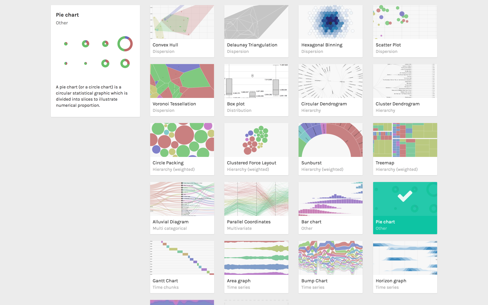
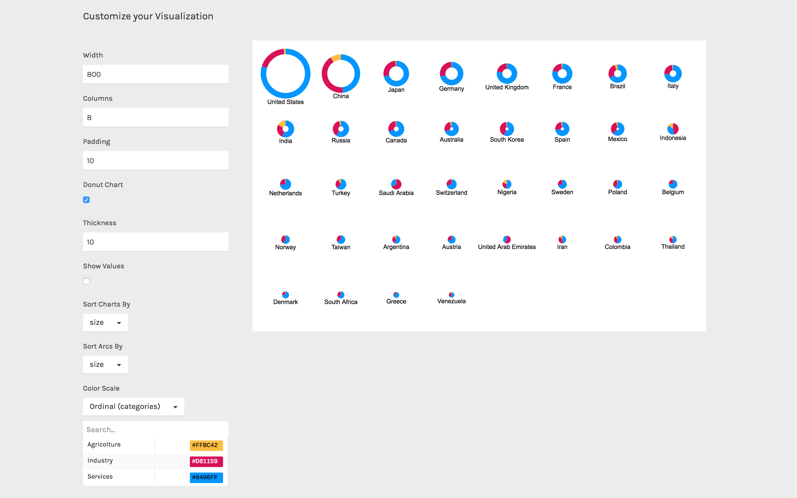

RAWGraphs is meant to quickly produce visualizations that are difficult to produce with other softwares. Pie charts are an available option in many softwares: what we’ve added is the ability to quickly create multiple pie charts starting from the same dataset.

**GOAL OF THE TUTORIAL**: with this tutorial we want to see the overall GDP for each country in the dataset and visualize its composition (shares of industry, agriculture and service). To achieve this goal, we will create a pie chart for each country composed by three arcs, one for each sector.

### 01. Load your data

The first step is to load your data into RAWGraphs.

Each row in the dataset will generate a pie chart. Each column in the dataset containing number will generate one of the arcs (in our case Agricolture, Industry and Services). Optionally an additional column can be used to define pies labels (in our case Country).

Here you can see the dataset we are going to use:

You can also load from the sample dataset directly in RAWGraphs: simply click &#8216;try our samples&#8217; > &#8216;Countries GDP&#8217;.

**Note: **The described dataset structure is often referred as ‘unstacked’ or ‘wide’. If you have data as narrow/stacked form, you can use the “stack/unstack” button: see the [tutorial](https://rawgraphs.io/learning/stack-your-unstacked-data-meet-the-unpivoter) here.

### 02. Choose the pie chart layout {#02-Choose-the-bar-chart-layout}

After pasting your data, scroll down and select the “pie chart” visual model.

 

### 03. Map your dimensions {#03-Map-your-dimensions}

The pie chart layout has two dimensions:

<table>
  <tr>
    <td>
      <b>FIELDS</b>
    </td>
    
    <td>
      <b>TYPE</b>
    </td>
    
    <td>
      <b>REQUIRED?</b>
    </td>
    
    <td>
      <b>MULTIPLE?</b>
    </td>
    
    <td>
      <b>DESCRIPTION</b>
    </td>
  </tr>
  
  <tr>
    <td>
      <b>Label</b>
    </td>
    
    <td>
      String, numbers
    </td>
    
    <td>
    </td>
    
    <td>
    </td>
    
    <td>
      The values in the dimension will be used as labels.
    </td>
  </tr>
  
  <tr>
    <td>
      <b>Arcs</b>
    </td>
    
    <td>
      numbers
    </td>
    
    <td>
       [fa class=&#8221;fa-asterisk&#8221;]
    </td>
    
    <td>
      [fa class=&#8221;fa-tags&#8221;]
    </td>
    
    <td>
      The field accept multiple dimensions. Each dimension added to this field will generate an arc for each pie chart.
    </td>
  </tr>
</table>

&nbsp;

It’s time to map your data and create the visualization. On the left you have the list of dimensions in your dataset, on the right the available visual variable of the pie chart layout.

Drag and drop the dimensions as following:

  * Drag Agriculture into Arcs;
  * Drag Industry into Arcs, below the previous one;
  * Drag Services into Arcs, below the previous one;
  * Drag Country into Label.

 

In this way we created a pie chart for each country (each row in the dataset). For each one, we defined three arcs (dimension dragged in the Arcs field). We then added a Label to each chart showing the country name.

### 04. Refine and export {#04Refine-and-export}

To reach the final results we can customize the visualization with some parameters you can find next to the visualization.  
For the pie chart the options available are the following:

&nbsp;

<table>
  <tr>
    <td>
      OPTION
    </td>
    
    <td>
      DESCRIPTION
    </td>
  </tr>
  
  <tr>
    <td>
      <b>Width</b>
    </td>
    
    <td>
      width in pixels.
    </td>
  </tr>
  
  <tr>
    <td>
      <b>Columns</b>
    </td>
    
    <td>
      pie chart will be disposed on a grid. This option allows to define how many pie charts must be drawn for each line. The number of lines is calculated according to this option.
    </td>
  </tr>
  
  <tr>
    <td>
      <b>Padding</b>
    </td>
    
    <td>
      the vertical and horizontal padding between pie charts, in pixels.
    </td>
  </tr>
  
  <tr>
    <td>
      <b>Donut chart</b>
    </td>
    
    <td>
      if selected, pie charts will be drawn ad donut chart. The size is defined by the <i>Thickness</i> option (see below)
    </td>
  </tr>
  
  <tr>
    <td>
      <b>Thickness</b>
    </td>
    
    <td>
      if <i>Donut chart</i> option is selects, this value will be used to defines its thickness.
    </td>
  </tr>
  
  <tr>
    <td>
      <b>Show Values</b>
    </td>
    
    <td>
      if selected, the absolute value of each value will be displayed with a label.
    </td>
  </tr>
  
  <tr>
    <td>
      <b>Sort charts by</b>
    </td>
    
    <td>
      order of the pie chart. Can be ‘size’ (from the biggest to the smallest), ‘name’ (alphabetical order).
    </td>
  </tr>
  
  <tr>
    <td>
      <b>Sort arcs by</b>
    </td>
    
    <td>
      order of the arcs inside each pie chart. Can be ‘automatic’ (same order in each pie chart), ‘size’ (from biggest to smallest in each pie chart) or ‘name’ (alphabetical order).
    </td>
  </tr>
  
  <tr>
    <td>
      <b>Color scale</b>
    </td>
    
    <td>
      list of dimensions headers dragged as ‘Arcs’. If set to ordinal, you can set a color for each value. If set to linear, the app will try to find the minimum and maximum value contained in the dimension, and then creating a gradient among those two values.
    </td>
  </tr>
</table>

&nbsp;

For the final results we have set the options as following:

<li style="font-weight: 400;">
  Set “columns” to 8.
</li>
<li style="font-weight: 400;">
  Select “Donut chart” option.
</li>
<li style="font-weight: 400;">
  Change the colors according to <a href="https://coolors.co/1c7989-0496ff-ffbc42-d81159-8f2d56">this scale</a>. Copy and paste the hex codes as following: for “Agricolture” #FFBC42. For “industry” #D81159. For “Services”: #0496FF
</li>

Here is the finished chart. You can export it in svg or png using the download function at the bottom of the page.

