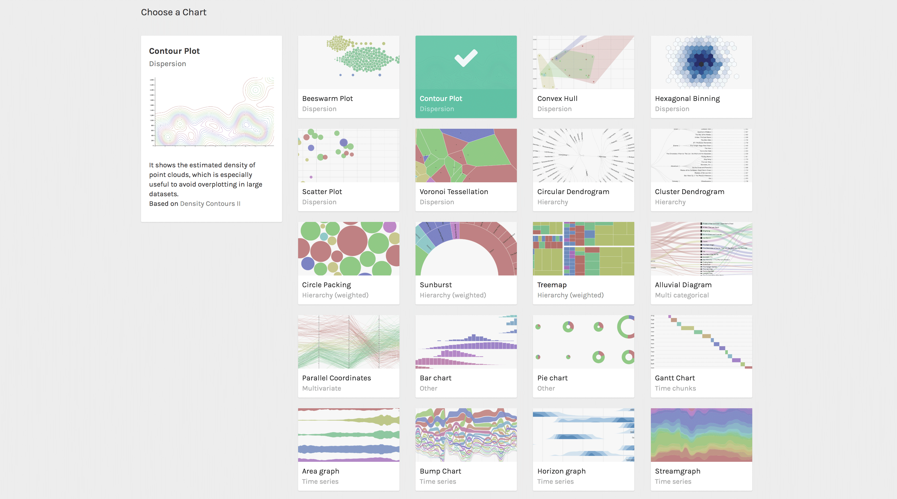
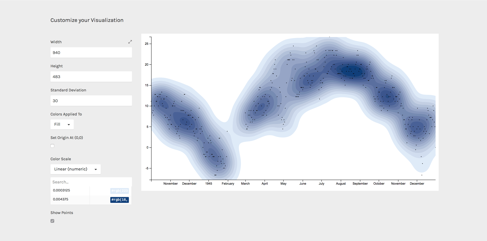

A contour plot shows the estimated density of point clouds, which is especially useful to avoid overplotting in large datasets.

**GOAL OF THE TUTORIAL**: comparing wheater condition (mean temperature) in Paris during the World War II, from 1944 to 1945.

### 01. Load your data

The first step is to copy and paste your data into RAWGraphs.

The dataset must contain at least two columns, one for the X Axis (in our case, Date) and one for the Y Axis (MeanTemp). 

Here you can see the dataset we are going to use:

<iframe src="https://docs.google.com/spreadsheets/d/e/2PACX-1vSY8S4qRSiZRnUuSNplZjzScVidsv9quD-ToXMRZVO_PImz-wmVuCvrEkwoAvt0osmTrSdNi0BJEByJ/pubhtml?gid=979813252&amp;single=true&amp;widget=true&amp;headers=false" width="100%" height="300"></iframe>

You can also download the dataset through the link on the left of this post.

In few second you should see the green bar saying “429 records in your data have been successfully parsed!”

### 02. Choose the contour plot layout

After pasting your data, scroll down and select the “contour plot” visual model.

### **03. Map your dimensions**

The contour layout has two visual variables. 

<table style="height: 73px;" width="600">
<tbody>
<tr>
<td><strong>VARIABLE</strong></td>
<td><strong>TYPE</strong></td>
<td><strong>REQUIRED</strong></td>
<td><strong>MULTIPLE</strong></td>
<td><strong>DESCRIPTION</strong></td>
</tr>
<tr>
<td><strong>X Axis</strong></td>
<td>Number, date</td>
<td>*</td>
<td></td>
<td>The horizontal position of the points.</td>
</tr>
<tr>
<td><strong>Y Axis</strong></td>
<td>Number, date</td>
<td>*</td>
<td></td>
<td>The vertical position of the points.</td>
</tr>
</tbody>
</table>

  It’s time to map your data and create the visualization. On the left you have the list of dimensions in your dataset, on the right the available visual variable of the scatter plot layout. 

Drag and drop the dimensions as following:

- Date as X Axis;
- MainTemp as Y Axis;

In this way we created a point for each movie in the dataset, disposing it on the cartesian plane according to its date and its mean temperature. 

### 04. Refine and export

To reach the final results we can customize the visualization with some parameters you can find next to the visualization. 

For the scatterplot the options available are the following:

<table>
<tbody>
<tr>
<td><strong>OPTION</strong></td>
<td><strong>DESCRIPTION</strong></td>
</tr>
<tr>
<td><strong>Width</strong></td>
<td>Artboard width in pixels</td>
</tr>
<tr>
<td><strong>Height</strong></td>
<td>Artboard height in pixels</td>
</tr>
<tr>
<td><strong>Standard deviation</strong></td>
<td>A quantity expressing by how much the members of a group differ from the mean value for the group.</td>
</tr>
<tr>
<td><strong>Colors applied to</strong></td>
<td>The possibility to apply colors to the stroke or to the fill of each curve.</td>
</tr>
<tr>
<td><strong>Set origin at (0,0)</strong></td>
<td>If selected, the contour plot origin will be set at the zero value for both the axes. If not selected, origin will be set to the minimum value for the two axes.</td>
</tr>
<tr>
<td><strong>colour scale</strong></td>
<td>List of uniques values in the dimension mapped as “color”. If set to ordinal, you can set a color for each value. If set to linear, the app will try to find the minimum and maximum value contained in the dimension, and then creating a gradient among those two values.</td>
</tr>
</tbody>
</table>

  For the final results we have set the options as following:

- Width to 940 pixels;
- Height to 483 pixels;
- Set standard deviation to 20;
- Set color scale to ‘linear’;
- Apply colors to &#8220;fill&#8221;;
- Set colors as following: from rgb(223, 235, 247) to rgb(16, 64, 122);
- Show points;

Here is the finished chart. You can export it in svg or png using the download function at the bottom of the page.

