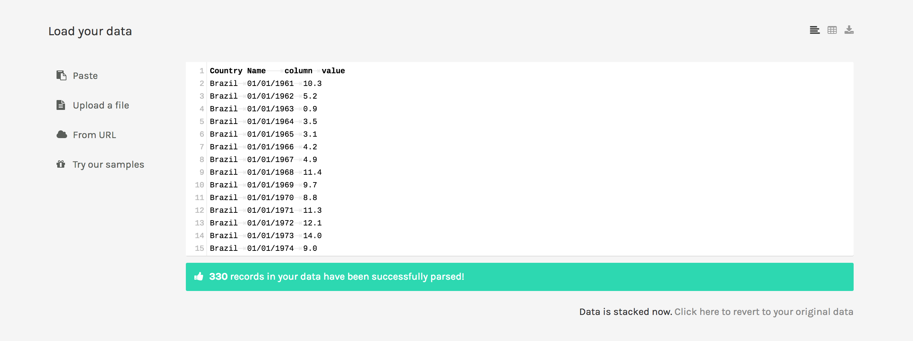

Wide, or unstacked data is presented with each different data variable in a separate column. Narrow, or stacked data is presented with one column containing all the values and another column listing the context of the value.

Here are two example of the same data in the two formats.

**Wide (or unstacked) table**:

<table class="wikitable">
  <tr>
    <th>
      Person
    </th>

    <th>
      Age
    </th>

    <th>
      Weight
    </th>

  </tr>

  <tr>
    <td>
      Bob
    </td>

    <td>
      32
    </td>

    <td>
      128
    </td>

  </tr>

  <tr>
    <td>
      Alice
    </td>

    <td>
      24
    </td>

    <td>
      86
    </td>

  </tr>

  <tr>
    <td>
      Steve
    </td>

    <td>
      64
    </td>

    <td>
      95
    </td>

  </tr>
</table>

&nbsp;

The same data in a **narrow (stacked) table**:

<table>
  <tr>
    <td>
      <b>Person</b>
    </td>

    <td>
      <b>Variable</b>
    </td>

    <td>
      <b>Value</b>
    </td>

  </tr>

  <tr>
    <td>
      Bob
    </td>

    <td>
      Age
    </td>

    <td>
      32
    </td>

  </tr>

  <tr>
    <td>
      Bob
    </td>

    <td>
      Weight
    </td>

    <td>
      128
    </td>

  </tr>

  <tr>
    <td>
      Alice
    </td>

    <td>
      Age
    </td>

    <td>
      24
    </td>

  </tr>

  <tr>
    <td>
      Alice
    </td>

    <td>
      Weight
    </td>

    <td>
      86
    </td>

  </tr>

  <tr>
    <td>
      Steve
    </td>

    <td>
      Age
    </td>

    <td>
      64
    </td>

  </tr>

  <tr>
    <td>
      Steve
    </td>

    <td>
      Weight
    </td>

    <td>
      95
    </td>

  </tr>
</table>

&nbsp;

RAWGraphs requires in most of the cases data in the narrow format.

Transforming data from the wide to the narrow format (operation sometimes defined unpivoting) is quite difficult with the commonly available tools.

This is the reason why we added the “Stack/unstack” function, AKA “the Unpivoter”.

### 01. load your data

In this tutorial we will visualize the [GDP Growth as recorded by the World Bank](http://data.worldbank.org/indicator/NY.GDP.MKTP.KD.ZG).

We prepared a simplified version of the dataset for this tutorial, you can see it here:

You can also download it through the link on the left. Once your data is loaded, you should see this:

### 02. Unstack your data

In the bottom-right corner of the data field, you should see the sentence “Your data seems unstacked. Click here to stack it”, as in the image below. Click on it.

A new menu (select a dimension to stack on) will appear. Open it, and select “Country Name”.

Now, the data is stacked, as in the image below:

in the first column you have the names of the countries, in the second one you have the years, and in the third ones the values.

With this operation you defined the main dimension (in this case, Country Name), which became the first column of the new dataset. In the second column, named column, are listed all the remaining headers of the previous table. In the third column, named value, are listed the values of the previous table.

### 03. Visualize your data

You can now use this data in RAWGraph, creating for example an Horizon Graph, a Streamgraph, or an Area graph.
